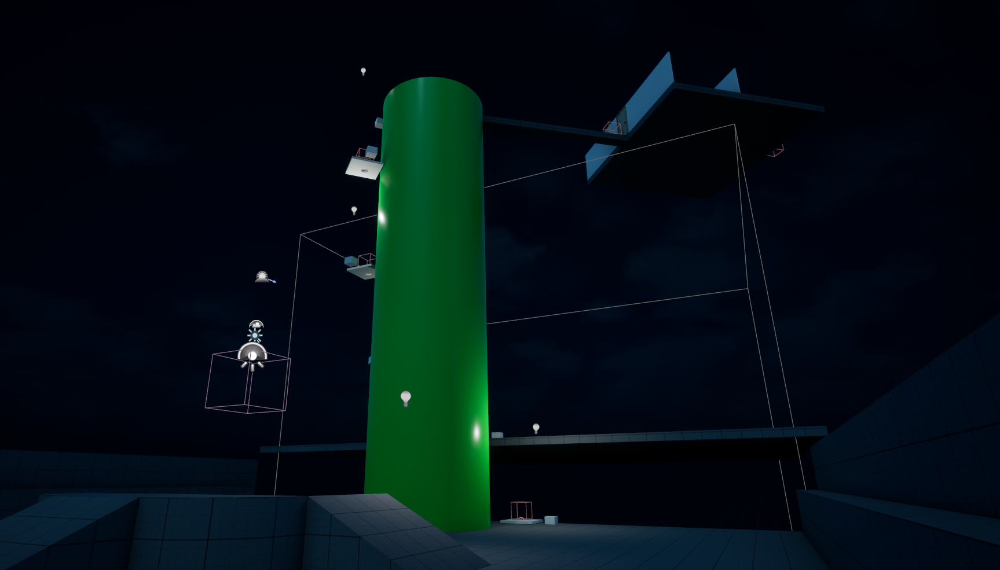
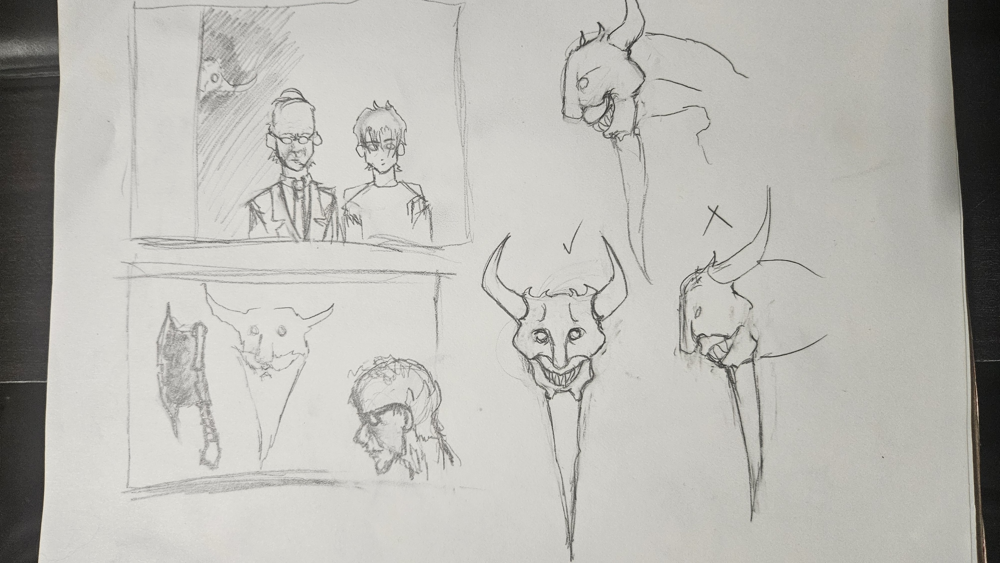

# The Graveleech

## 1. Game Overview

**Genre:** Horror  
**Platform:** PC  
**Target Audience:** Mature players, ages 17+

### Overview

*The Graveleech* is a third-person horror game prototype developed to explore the fundamental mechanics and design principles of a horror game. The project focuses on player movement, environmental interaction, enemy behavior, exploration, level design, and simple weapon mechanics.

The game's narrative and horror encounters were used to guide the development of the gameplay experience and the design of its environments.

---

## 2. Core Gameplay

The core gameplay of *The Graveleech* focuses on exploration, interaction, and surviving encounters with enemies.

### Basic Mechanics

3D seemed to be more immersive than I thought. Exploring will be the most powerful and immersive part of this mini-prototype game.

Although adding other traversal mechanics will wait.

### Core Gameplay Loop

**Explore → Interact → Discover → Encounter Threat → Survive → Progress**

---

## 3. Player

**Role and Abilities**

- Main player plays the hero
- Holds a pistol for weapon usage
- Flashlights can be picked up at the beginning at some levels

### Goals

- Take out enemies and avoid boss enemies
- Finding exits and escaping

---

## 4. Game Systems

**Systems implemented in the prototype**

- Interaction system
- Flashlight system
- Weapon system (In Progress)
- Enemy AI
- Jumpscare system
- Trigger/event systems (In Progress)

---

## 5. World / Level Design

- Environment represents a prototype map with elavators
- Player can explore and look around, as well as fear the height
- Room test key usage
- Horror encounter placement so that the player can test the chase sequence from the enemy

---

## 6. Enemy / Monster

- Enemy appearance
- Behavior
- AI
- Detects Player
- Chase behavior
- Jumpscare activates on Overlap

---

## 7. Story and Narrative

The story started off with the main player.

---

## 8. Art

- Cartoonish look, nothing crazy
- Sketches used in Blender for shape references
- Custom assets created by TarCreator (Jose Pinto)

---

## 9. Audio

There is so far only a jumpscare audio, using Unreal Engine's default sound.

---

## 10. UI / UX

The Main Menu uses a simple menu startup, with **Start Game** being the first option.

**Quit Game** is self-explanatory.

---

## 11. References

### The Horror Framework by Hydra_UE

**Engine:** Unreal Engine

**Type:** Horror Game Framework / Blueprint Template

Used as a technical and design reference for implementing and understanding common horror-game systems in Unreal Engine, including interaction, flashlight mechanics, enemy behavior, jumpscares, doors, and gameplay flow.

[The Horror Framework — Fab](https://www.fab.com/listings/acae9820-9b81-421a-b497-518801e94cf8)
