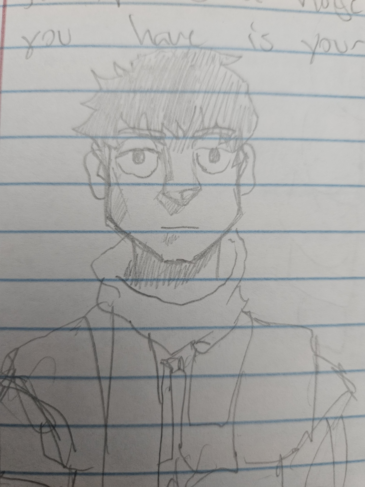
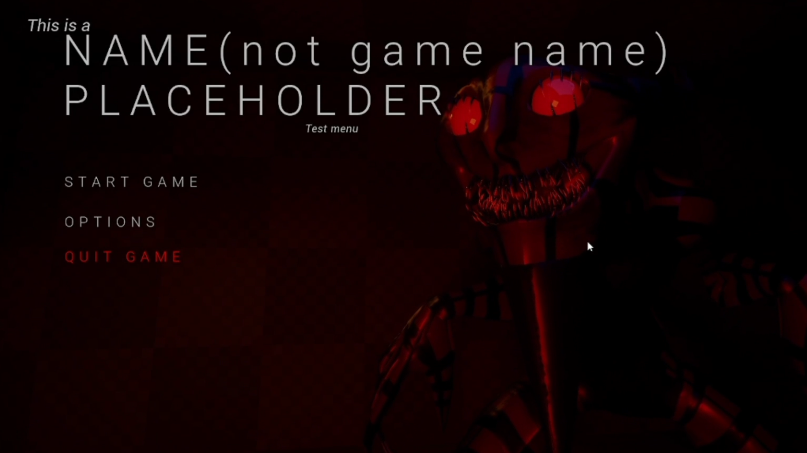

# The Graveleech

## 1. Game Overview

**Genre:** Horror
**Platform:** PC
**Target Audience:** Mature Players, Ages 17+

### 1.1 Overview

*The Graveleech* is a third-person horror game prototype developed to explore the fundamental mechanics and design principles of a horror game.

The project focuses on:

* Player movement
* Environmental interaction
* Exploration
* Enemy behavior
* Level design
* Simple weapon mechanics
* Horror encounters
* Gameplay events and triggers

The game's narrative and horror encounters were used to guide the development of the gameplay experience and the design of its environments.

### 1.2 Project Goals

The primary goal of the prototype was to explore how 3D environments can be used to create an immersive horror experience.

Exploration is the primary focus of the prototype, while additional traversal mechanics were intentionally left for future development.

---

## 2. Core Gameplay

### 2.1 Gameplay Focus

The core gameplay of *The Graveleech* revolves around exploration, environmental interaction, discovery, and surviving encounters with enemies.

The prototype is designed around allowing the player to explore an unfamiliar environment while gradually introducing threats and horror encounters.

### 2.2 Core Gameplay Loop

**Explore → Interact → Discover → Encounter Threat → Survive → Progress**

This gameplay loop represents the primary structure of the prototype.

---

## 3. Player

### 3.1 Player Role

The player controls the main protagonist as they explore the game's environments and attempt to survive encounters with hostile entities.

### 3.2 Player Abilities

The player can:

* Move through the environment
* Explore rooms and areas
* Interact with objects
* Use a flashlight
* Use a pistol
* Encounter and evade enemies
* Find exits and progress through the environment

### 3.3 Player Goals

The player's primary goals are:

* Explore the environment
* Discover important areas and objects
* Survive enemy encounters
* Avoid dangerous encounters when necessary
* Find exits
* Escape the environment

---

## 4. Game Systems

The prototype contains several gameplay systems that support exploration and horror encounters.

### 4.1 Interaction System

Allows the player to interact with objects and elements within the environment.

### 4.2 Flashlight System

Provides the player with a flashlight to illuminate dark areas and support exploration.

Flashlights can be picked up at the beginning of certain levels.

### 4.3 Weapon System

A pistol-based weapon system is being developed for the prototype.

**Status:** In Progress

### 4.4 Enemy AI System

Controls enemy detection and pursuit behavior.

The system allows enemies to detect the player and begin a chase sequence.

### 4.5 Jumpscare System

Triggers a jumpscare when specific conditions are met, such as the player entering an enemy's attack range.

### 4.6 Trigger / Event System

Used to control gameplay events and scripted interactions throughout the environment.

**Status:** In Progress

---

## 5. World and Level Design

### 5.1 Environment

The prototype environment is designed around exploration and horror encounters.

The map contains:

* Hallways
* Rooms
* Elevators
* Exploration areas
* Triggered encounter locations
* Test areas for gameplay systems

### 5.2 Exploration

Exploration is one of the primary focuses of the prototype.

The player is encouraged to look around the environment, discover different areas, and experience the atmosphere of the 3D space.

The prototype also uses environmental height to create a sense of uneasiness and fear.

### 5.3 Gameplay Testing Areas

Certain areas of the environment are designed to test specific mechanics, including:

* Room and key interactions
* Elevator functionality
* Enemy encounters
* Chase sequences
* Triggered horror events

### 5.4 Horror Encounter Placement

Enemy encounters are positioned throughout the environment to test how the player responds to sudden threats and chase sequences.

---

## 6. Enemy / Monster

### 6.1 Enemy Appearance

The Graveleech is the primary hostile creature used in the prototype.

Its visual design was created to support the horror atmosphere of the game while maintaining the project's stylized visual direction.

### 6.2 Enemy Behavior

The enemy uses basic AI behavior to:

* Detect the player
* Pursue the player
* Trigger a chase sequence
* Activate a jumpscare when the player enters the appropriate range

### 6.3 Enemy Encounter

Enemy encounters are designed to create moments where the player must react to an immediate threat.

The current prototype focuses on testing the basic structure of detection, pursuit, and jumpscare behavior rather than implementing complex enemy combat.

---

## 7. Story and Narrative

### 7.1 Narrative Overview

The story began with the main player and was used as a foundation for developing the prototype's environments and horror encounters.

The narrative currently serves primarily as a framework for the gameplay experience rather than being the primary focus of the prototype.

### 7.2 Narrative Integration

Story elements and horror encounters are incorporated into the environment to give the player context for their exploration and progression.

---

## 8. Art and Visual Design

### 8.1 Visual Style

The prototype uses a stylized, cartoon-like visual direction.

The goal was not to create highly realistic visuals, but to establish a recognizable visual identity while focusing development time on gameplay systems and exploration.

### 8.2 3D Assets

Custom 3D assets were created for the project.

Blender sketches and reference images were used to establish the shapes and proportions of the game's models.

### 8.3 Asset Creation

Custom assets were created by **TarCreator (Jose Pinto)**.

---

## 9. Audio

### 9.1 Current Audio

The prototype currently contains limited audio implementation.

A jumpscare sound effect is currently used during enemy encounters.

The prototype uses Unreal Engine's default audio resources for the current implementation.

### 9.2 Future Audio

Additional environmental, atmospheric, and gameplay audio can be added in future development to improve immersion and reinforce horror encounters.

---

## 10. UI / UX

### 10.1 Main Menu

The prototype uses a simple main menu designed to provide the player with basic game-start and exit functionality.

### 10.2 Menu Options

**Start Game**

Begins the game and loads the playable experience.

**Quit Game**

Exits the game.

---

## 11. Development Tools and Technology

**Game Engine:** Unreal Engine
**Primary Development Tools:** Unreal Engine Blueprints, Blender

### 11.1 Development Focus

The project was developed as a learning-focused prototype to gain practical experience with:

* Unreal Engine
* Blueprint systems
* Gameplay logic
* AI behavior
* Level design
* 3D asset creation
* Environmental interaction
* Horror-game design

---

## 12. References

### The Horror Framework — Hydra_UE

**Engine:** Unreal Engine
**Type:** Horror Game Framework / Blueprint Template

The Horror Framework was used as a technical and design reference while learning how common horror-game systems can be implemented in Unreal Engine.

It provided reference material for systems including:

* Player interaction
* Flashlight mechanics
* Enemy behavior
* Jumpscares
* Doors
* Gameplay flow

**Reference:** [The Horror Framework — Fab](https://www.fab.com/listings/acae9820-9b81-421a-b497-518801e94cf8)

The framework served as a reference for understanding these systems. Project-specific implementations and assets were developed as part of the prototype.

---

## 13. Prototype Status

*The Graveleech* is currently a prototype rather than a completed commercial game.

### Implemented

* Third-person player movement
* Exploration
* Environmental interaction
* Flashlight system
* Basic enemy AI
* Enemy detection
* Enemy chase behavior
* Jumpscare system
* Prototype level design
* Main menu
* Custom 3D assets

### In Progress

* Weapon system
* Trigger / event systems
* Additional gameplay mechanics

### Future Development

Potential future development includes:

* Additional traversal mechanics
* Expanded enemy behavior
* More environmental interactions
* Expanded audio design
* Additional horror encounters
* More developed narrative content
* Expanded UI/UX
