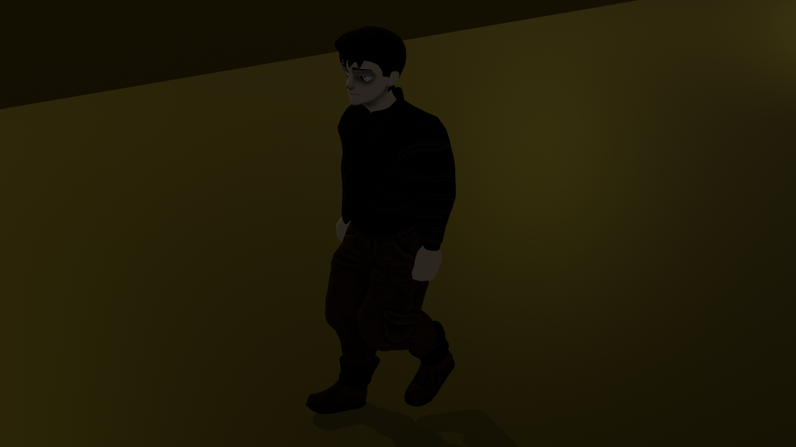
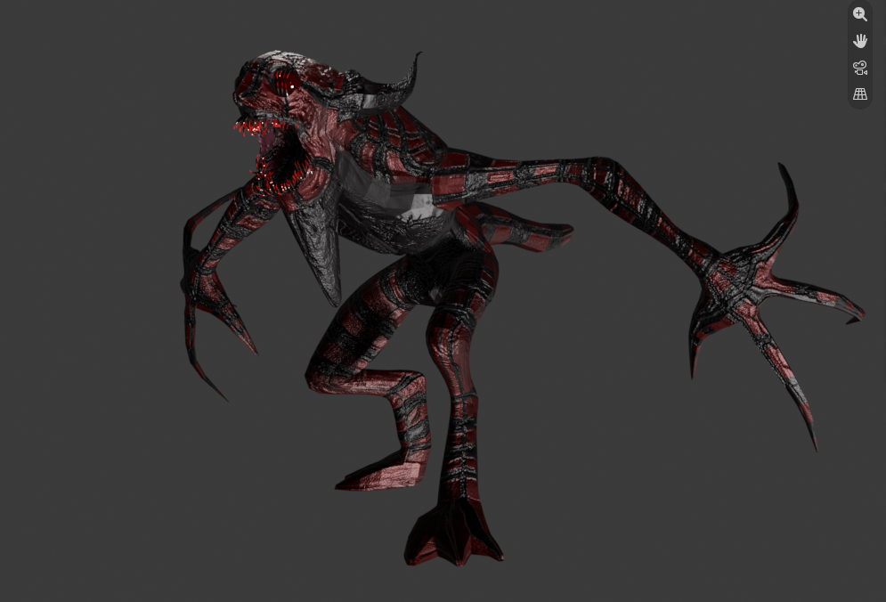
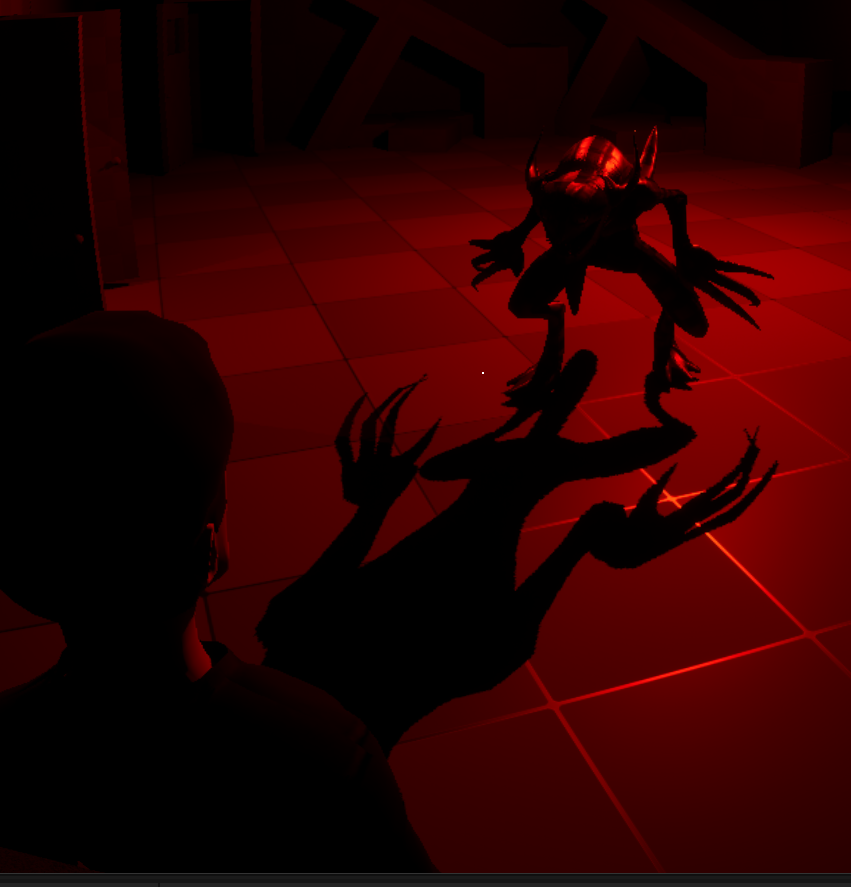
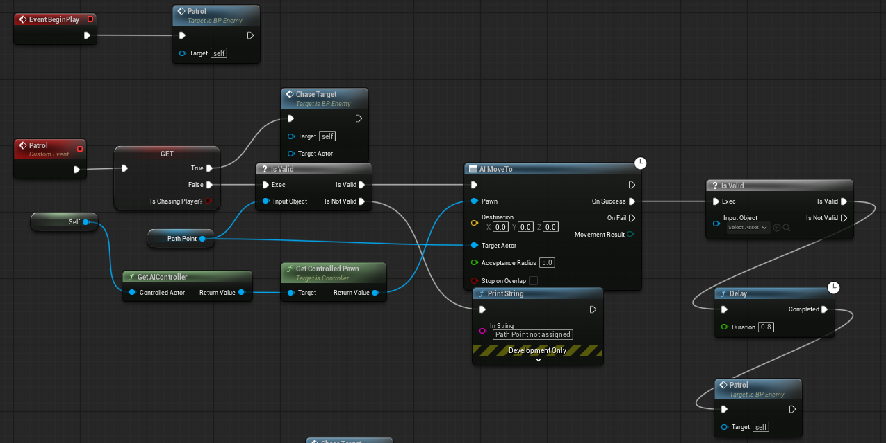

# Unreal Horror Prototype

A third-person horror game prototype focused on flashlight mechanics,
interactive systems, level design, exploration, and basic enemy AI.

Game Development Document:

Developed over one month while learning the fundamentals of game design
and gameplay development.

## Overview

This project was created as a learning-focused horror prototype to explore
the fundamentals of third-person gameplay, environmental interaction,
exploration, and basic enemy behavior.

The goal was to create a small playable horror experience while developing
my understanding of Unreal Engine and gameplay systems.

## Features

- Third-person character movement
- Flashlight system
- Interactive objects and environmental interactions
- Exploration-focused level design
- Basic enemy AI
- Horror events and encounters

## My Contributions

### Gameplay
- Implemented player movement
- Implemented flashlight functionality
- Created interactive gameplay systems
- Implemented basic enemy interactions

### Level Design
- Designed the playable environment
- Created exploration paths and gameplay spaces
- Placed interactive elements and gameplay events

### 3D Development

- Created original 3D assets using Blender
- Created and applied materials to original assets
- Integrated assets into Unreal Engine

### Programming

- Developed gameplay logic using Blueprints
- Used Blueprint communication and event-driven systems
- Implemented interaction and gameplay conditions

## Technologies

- Unreal Engine 5
- Blueprints
- Blender
- Git / GitHub

## Copyright & Asset Usage

Copyright © 2026 TarCreator. All rights reserved.

This repository is provided for portfolio and educational viewing.

Original assets and source code created for this project are not licensed
for reuse or redistribution without permission.

Third-party materials remain subject to their respective licenses. This
repository does not grant additional rights to third-party materials.
